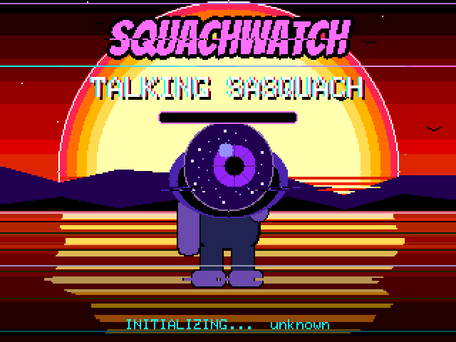
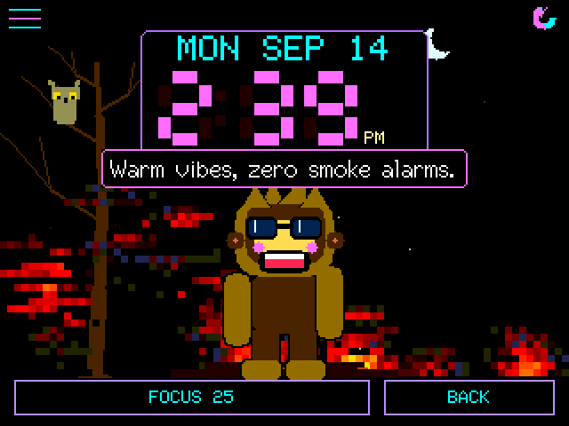
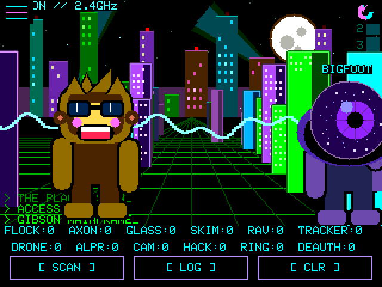
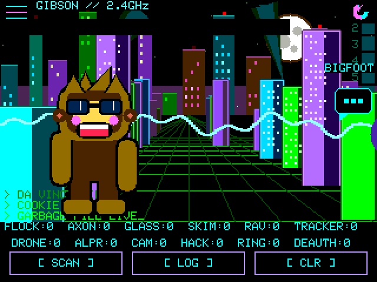
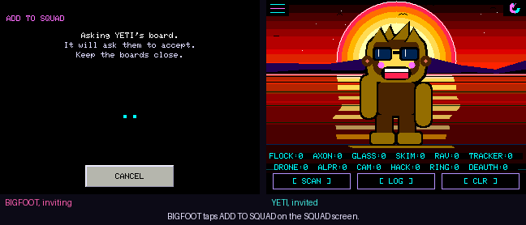
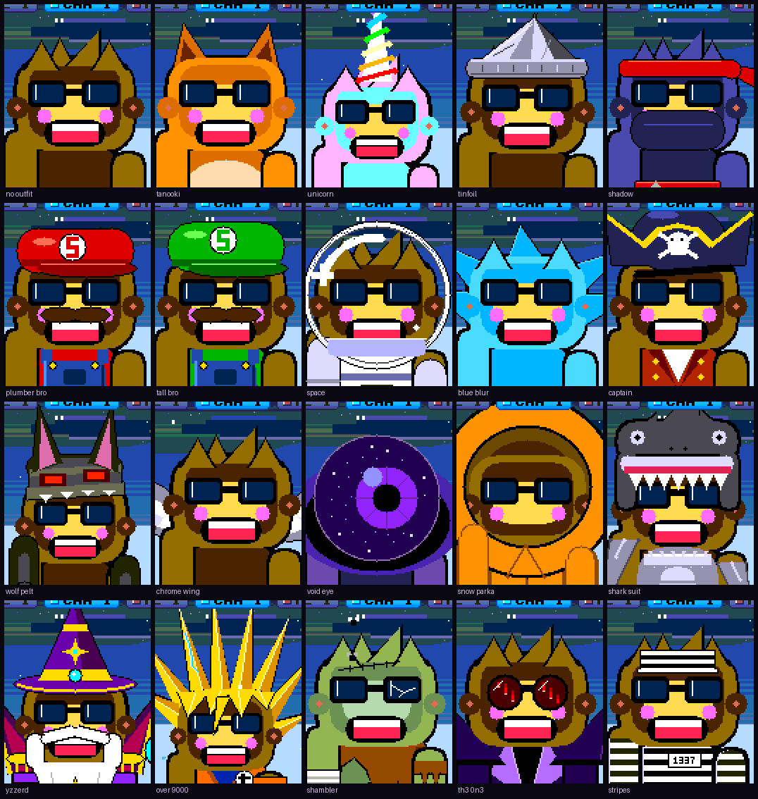

# SquachWatch-CYD

> Surveillance-device detector for the ESP32-2432S028R ("Cheap Yellow Display"), and a growing list of other ESP32 boards.

SquachWatch-CYD sniffs WiFi and Bluetooth for known wireless signatures
of Flock Safety cameras, Axon body cameras, recording glasses, card
skimmers, AirTags, drones, proximity beacons and pentest hardware. On the
2.8" CYD it listens on 2.4 GHz and runs standalone on the bare board — no
PC, no extras, just plug it into USB. A few other boards hear more: the
NM-CYD-C5 scans 5 GHz as well, and the T-Watch S3 listens to LoRa, with GPS
on the S3 Plus (see [Boards](#boards)).

The UI is a vaporwave-themed take on the **SquachWare** aesthetic: matrix
digital rain, Squachy the mascot, full-screen dramatic ALERT overlays, and
the glitchy SquachWatch wordmark.

<p align="center">
  <a href="https://squachwatch.com/emulator/" title="Drive it in your browser">
    
  </a>
</p>

<p align="center">
  <b>That is the firmware itself, not a mockup.</b><br>
  Every frame above was rendered by the same C++ that runs on the board,
  compiled for a PC.<br>
  <a href="https://squachwatch.com/emulator/"><b>Click it to drive it in your browser &rarr;</b></a>
</p>

## What it detects

| Type | What | How |
|---|---|---|
| `FLOCK` | Flock Safety ALPR cameras | 49 WiFi OUI prefixes + `flock-` and bare `Flock` SSIDs + BLE names (Flock, Penguin, Pigvision, a bare ten-digit battery serial) + company ID `0x09C8` + Flock's own BLE service UUID |
| `AXON` | Axon body cameras, TASERs, LE equipment | 3 WiFi OUI + SSID prefixes `AB2-`/`AB3-`/`AB4-`/`AXON-` |
| `META` | Camera glasses — Ray-Ban Meta, Snap Spectacles | BLE service UUID `0xFD5F` + Meta / Luxottica / Snap company IDs |
| `SKIMMER` | Bluetooth card skimmers (HC-05/06/03, RN42, BT04-A) | BLE advertised-name match + SPP UUID `0x1101` + 3 OUI |
| `RAVEN` | Raven gunshot detector | Any service UUID from `0x3100` to `0x3500` |
| `AIRTAG` | Apple AirTag / Find My trackers | Company ID `0x004C` + Find My payload check |
| `DRONE` | Remote ID drones | Remote ID in a BLE advert's service data (`0xFFFA`) or in a WiFi beacon's vendor element, then the ASTM F3411 message **decoded** — aircraft position, altitude, serial, and the operator's location |
| `ALPR` | Motorola Solutions / Genetec plate readers | 7 WiFi OUI (5 Motorola, 2 Genetec) |
| `CAMERA` | Generic / covert IP cameras | 17 WiFi OUI (Wyze, Amazon, Tuya, Verkada, Avigilon, Axis, …) |
| `SAMSUNG_TAG` | Samsung Galaxy SmartTag / SmartTag+ | BLE service UUID `0xFD5A` |
| `GOOGLE_TAG` | Google Find My Device trackers (Chipolo, Pebblebee, Moto Tag) | BLE service UUID `0xFEAA` |
| `TILE` | Tile BLE trackers | BLE service UUID `0xFEED` / `0xFEEC` |
| `RING` | Ring doorbells / cameras | 15 WiFi OUI (Ring LLC's registered block + Amazon's) |
| `DEAUTH` | WiFi deauthentication floods | Rate-detected burst, not a signature |
| `EVILTWIN` | Rogue / spoofed access points | One SSID beaconing from two BSSIDs that disagree about encryption |
| `IBEACON` | Retail proximity beacons | Exact Apple header `4C 00 02 15` — **off by default**, see below |
| `HACKER` | Flipper Zero, Pwnagotchi, WiFi Pineapple, ESP deauthers | Flipper's service UUIDs `0x3081`–`0x3083`, company ID `0x0E29` and OUI `0C:FA:22`; the Pwnagotchi's own beacon payload; `Pineapple_` and `pwned` SSIDs |

### Confidence is per signature, not per type

Every hardware prefix in the firmware was checked against the IEEE registry
rather than against other detectors. Of 97 rows: **33 High, 4 Medium, 60
Low**.

That grading matters most on `FLOCK`, where exactly **one** of 49 prefixes is
registered to Flock Safety and the rest are the generic chip and module
makers' blocks they build on (Espressif, Liteon, Silicon Labs and friends) —
real evidence, shared with every dev board on earth.
`ALERT FILTER` is a minimum-confidence gate, so setting it to High keeps a
passing ESP32 in the log without taking over the screen.

The audit also removed `00:0E:58`, which sat here for eleven releases
labelled "Vigilant" and is registered to **Sonos**. Every speaker in range
was being logged as a plate reader.

`IBEACON` ships switched off — not a judgement about importance, one about
volume. One shop can put more beacons in range than this device would
otherwise see all week. It is one tap away in `TYPE FILTER`.

## Boards

Not sure which to buy? The **2.8" CYD** (ESP32-2432S028R) is about $15 and
is the board everything here is designed on: built-in 320×240 TFT,
resistive touch, a microSD slot and an RGB light, and nothing else to add.
No GPS, no extra modules; the board is the whole device. Every board below
is on the [web flasher](https://squachwatch.com/). BETA means it runs the
whole firmware but has had fewer hours on it. The longer answer is in
[docs/FAQ.md](docs/FAQ.md).

| Board | Flasher | Worth knowing |
|---|---|---|
| 2.8" CYD — ESP32-2432S028R | Yes | Ships with an ST7789 or an ILI9341 screen depending on the batch, and the flasher has both. A solid white screen means try the other one |
| 3.2" capacitive — ESP32-2432S032C | Yes | IPS screen, capacitive touch |
| 3.2" resistive — Freenove FNK0103 | Yes | IPS screen |
| RL Phantom 2.4" — ESP32-2432S024R | Yes | Status light on the front |
| AWOK 2.4" — ESP32 Marauder v6.1 | Yes | |
| 3.5" resistive / capacitive — ESP32-3248S035R / C | BETA | |
| ESP32-32E 2.8" / 3.5" — E32R28T / E32R35T | Via another build | Takes the 2.8" CYD ILI9341 build and the 3.5" resistive one; type the code into the flasher's board finder |
| Freenove ESP32-S3 2.8" — FNK0104B | BETA | Capacitive touch, SDMMC card slot, WS2812 light, battery connector. Pins in [docs/PINOUT.md](docs/PINOUT.md) |
| Elecrow CrowPanel Advance 7.0 | BETA | 800×480, drawn at 400×240 doubled on purpose. Has a buzzer, silent unless you switch it on. [docs/CROWPANEL7.md](docs/CROWPANEL7.md) |
| RockBase NM-CYD-C5 | BETA | The 2.8" CYD's glass on an ESP32-C5, the first RISC-V chip here. Scans **5 GHz** too (WIFI BANDS in Settings). [docs/NM-CYD-C5.md](docs/NM-CYD-C5.md) |
| M5Stack StickS3 | BETA | 1.14" screen, landscape, two buttons |
| M5Stack Cardputer ADV | BETA | Driven from its keyboard. Not the original Cardputer |
| LilyGo T-Watch S3 / S3 Plus | BETA | On your wrist, with a battery and a buzz. Listens to **LoRa**; the S3 Plus adds **GPS**. See [On the watch](#on-the-watch) |

Each board has its own build in `platformio.ini`, one `[env:...]` each, with
what is and is not confirmed on it.

## Web Flash

No build tools, no IDE, no cloning anything — flash a board straight
from your browser:

**[https://squachwatch.com/](https://squachwatch.com/)**

Works in Firefox, Chrome, Edge, or Brave on desktop. Pick your board from
the list (it is grouped by family, and there is a box for the code printed
on the back if you are not sure which you have), plug in, click Connect &
Install, done. A T-Watch has its clock set for it once the install
finishes.

## Build

Three steps:

1. Install [PlatformIO](https://platformio.org/) (CLI or VS Code extension).
2. Clone the repo:
   ```sh
   git clone https://github.com/skizzophrenic/SquachWatch-CYD
   cd SquachWatch-CYD
   ```
3. Build and flash:
   ```sh
   pio run -t upload
   ```
   For a board that is not the default three, name its build, e.g.
   `pio run -e freenove-s3 -t upload`.

The first build pulls the TFT_eSPI, XPT2046, and NimBLE-Arduino
libraries; after that it's incremental.

A full beginner-friendly walkthrough is in [docs/BUILD.md](docs/BUILD.md).

## Updating

Your settings, PIN and squad stay put whichever way you go.

| How | Where | Boards |
|---|---|---|
| **UPDATE OVER WIFI** | Settings → SYSTEM → UPDATE FIRMWARE | Every board. It joins a saved network (or lists the ones in range and takes the password) and downloads the release for its exact board from squachwatch.com |
| **UPDATE OVER BLUETOOTH (BETA)** | The same screen, then [squachwatch.com/update](https://squachwatch.com/update/) in a desktop browser | The T-Watch S3 and the other ESP32-S3 boards. Every other board dropped it to make room |
| **USB** | The [web flasher](https://squachwatch.com/) | Every board, and the way back if the other two can't get through |
| **UPDATE SQUAD** | The same screen | Tells your squad to update themselves; see [Updating the squad](#updating-the-squad) |

Every over-the-air update is signed, and a board refuses anything not signed
by this project or not built for its own board. A new version starts on trial: if
it crashes or loses power in its first 30 seconds the board goes back to
the one it had, and **SWITCH TO** on the same screen goes back by hand.

When a WiFi update can't get through, the screen says which thing is in the
way: a hotel or school network that wants a sign-in page first, a network
that blocks the site, a router that can't look the name up (the board then
tries the site's fixed addresses), or the site being slow, down or
secure-only. Each message ends in a short code in brackets to quote if you
ask for help. Those messages arrived in v1.33.0, so a board on anything
older that can't reach the site needs one USB install to get them.

### Knowing there is an update

Two ways, neither of which installs anything. At boot, a board with a saved
WiFi network joins it for about a second, asks squachwatch.com for the latest
version of its own build, and lets go again, all before Bluetooth starts;
**UPDATE CHECK** on the SYSTEM page turns that off. And every board's hello
to its squad carries its version, so a board that hears a member running
something newer knows without touching WiFi. Either way Squachy says it once
on the main screen, the SYSTEM row reads UPDATE, and UPDATE FIRMWARE names
the version until you install it.

**WIFI NETWORKS** on the SYSTEM page is where the board keeps the networks it
knows: up to six, with USE marking the one it tries first. ADD picks one from
a scan and takes the password on the board's keyboard; it is not checked by
joining, since joining means giving Bluetooth up until a restart, but at the
next boot check, and each row then says how that went: joined, wrong
password, or not found. At boot the board scans, joins the USE network if it
is there and otherwise the strongest saved one that is, so home and work both
just work. The update flow does the same, and only shows its own list when
none of the saved networks is in range. REMOVE takes one off the list.

## Usage

1. Plug the CYD into USB-C.
2. The splash runs for a second and a half, stamped with the build's own
   version (from `git describe`, so a working-tree build says so).
3. The main screen appears: your chosen background, Squachy, and a counter
   button along the top for each kind of thing in range. He says something
   reassuring every thirty seconds.
4. The three soft buttons at the bottom:
   - **`[ SCAN ]`** — return to the main (idle) screen.
   - **`[ LOG ]`** — open the detection log, each device once. It survives
     a restart: about 1,800 sightings are kept in flash.
   - **`[ DESK ]`** — desk mode: the big clock, with Squachy under it.
   - On the LOG screen the third button is **`[ CLR ]`** — wipe the log and return.
5. When something is detected, the device **flashes a full-screen ALERT**:
   a header strip in the detection's own colour with the type in the
   Bangers face, a data plate with the vendor, the device's own name where
   it broadcasts one, its MAC and a signal meter, and a gauge showing what
   was found with the instrument grid over it. Tap anywhere to dismiss
   early, or it clears itself after 10 seconds. A device on your watch list
   gets LOCKED ON instead, which waits for your tap (see
   [Alert controls](#alert-controls)).

If a microSD card is present, every detection is also appended to
`squachwatch-<day>.log` (CSV: `ts,type,rssi,mac,channel,vendor,ssid`).

### The clock

There is no GPS (except on the T-Watch S3 Plus, which sets its clock from
it when it has a fix), and the board never joins a network to scan. But it
does join one for the update check at boot, and for UPDATE OVER WIFI, and the
clock rides along: one NTP round trip while the radio is up anyway, about a
second. The zone is yours to pick, and there are three ways: the web
flasher's **Set Time & Zone** button sends this computer's clock and zone
down the same cable right after flashing; the first time the clock is set
with no zone chosen, a card on the main screen asks, with the live time in
the zone it shows so you can see when it's right; and **TIME ZONE** on the
DESK MODE page changes it later. Daylight saving takes care of itself. Without
a saved network the clock can still be set over serial with a `TIME <epoch>`
line at 2,000,000 baud, and `ZONE US EASTERN` sets the zone the same way.
And every squad hello carries the sender's clock and zone, so a board with
neither takes them from the first member it hears: update one board by USB
and the rest of the squad know the time within a minute of meeting it.
Until the clock is set, timestamps count from boot. The board keeps a
note of the time in flash every ten minutes, and a cold boot with no clock
starts from that note: not the right time, since nobody knows how long the
power was off, but never earlier than the note, which keeps the day count
honest. Such a clock is used for the date only; the LOG times, the night
tag, the hour lines and the desk digits wait for a real answer.

Once it is set, the LOG shows the real time of each catch (or the date, for
one from another day); the alert card says **AT NIGHT** for anything caught
between eleven and five, and Squachy's line sharpens to match; he says hello
once a day with the date in it, knows whether it's Monday, lunch, the three
o'clock slump or two in the morning, and counts the days since the board
first knew the date: a week, a month, a hundred days, a year.

**BANTER** on the APPEARANCE page sets how much he talks when nothing is
happening: IMPORTANT (idle chatter off; he still speaks for a catch, a
message, a newer release and the daily hello), LESS, NORMAL or MORE. The
set pieces two Squachys act out follow the same setting.

### Desk mode

<p align="center">
  
</p>

**DESK MODE** in Settings turns the board into the thing beside the
keyboard: your background, the date and the time in big seven-segment
digits on a plate over it, Squachy underneath doing what he does, and a
focus timer. **FOCUS 25** starts twenty-five minutes: the scene clears, he
goes still and quiet, and when it runs out the light on the back goes
green, he tells you to stand up, and a five-minute break counts down on its
own. A tap on the running timer stops it. The desk keeps its own
background, picked with a tap at the left or right edge and remembered
separately from the main screen's. Detection keeps running behind all of
it: a catch shows as a small card by the buttons instead of the full
ALERT (tap it for the full card), and a squad message stands where Squachy
stands, as a polaroid of the sender's Squachy with his name in the margin,
the message on a note beside it and the time it came, until you tap it.
The power saver never dims this screen.

## Alert controls

A detector that cries wolf gets switched off, so there are a few ways to
tell it what you care about. Apart from TYPE FILTER, none of these stop
anything being scanned, counted or logged; they only decide what takes over
the screen.

| Control | Where | What it does |
|---|---|---|
| **IGNORE** | The alert card, or a LOG row | That one device never raises an alert again, and its LOG row wears an IGNORED tag. UN-IGNORE undoes it; Settings → IGNORED lists them all |
| **SNOOZE** | The alert card | The same, until the board restarts |
| **AUTO SNOOZE** | Settings: OFF, AFTER 5, AFTER 10 | After that many alerts a device has to come 7 dB closer than it ever has before it may interrupt again. Its allowance comes back after half an hour |
| **ALERT FILTER** | Settings: ALL, MED+, HIGH ONLY | The lowest confidence allowed to take over the screen |
| **TYPE FILTER** | Settings | Whole detection types on or off. An off type is dropped, not logged |
| **Watch list** | Hold a LOG row, then WATCH | When that device turns up you get **LOCKED ON**: a radar scope with its signal and whether it is getting closer, which stays until you tap it. A watched device always gets through AUTO SNOOZE and spam floods |
| **HUNT MODE** | HUNT on the alert card, or hold a LOG row | A signal gauge to walk the device down. While a hunt runs, the HUNTING pill on the main screen takes you back to it; STOP HUNT ends it |
| **Spam floods** | Automatic | A storm of fake tags (piles of addresses heard for a moment and never again) gets one alert with a SPAM: N FAKE TAGS banner, then quiet logging until it dies down |
| **HEADS-UP** | Settings → SQUACHMESH | Serious catches from your squad's boards arrive as a banner; see [SquachMesh](#squachmesh) |

## Security and privacy

**Settings → SECURITY** puts a PIN on the board: 4, 6 or 8 digits, with
LOCK AT BOOT, AUTO-LOCK (when the screen sleeps, or after 1 to 30 idle
minutes), ALERTS LOCKED (what an alert shows while locked: FULL, TYPE ONLY
or NONE) and WIPE AFTER 10 wrong guesses. It says plainly what it is for:
people at the table, not someone with a USB cable.

A **DURESS PIN** is a second PIN of the same length. Typed at the lock
screen, it erases the squad phrase and messages, the ignore list, the saved
WiFi passwords and the log (in flash and on the SD card, and the watch's GPS
log), then restarts quietly, with the status light dark and no splash, and
comes back unlocked on the main screen. To anyone watching, it was an
unlock.

**PRIVACY MODE** (Settings → SYSTEM) is for filming and screenshots:
addresses show as `AA:BB:CC:XX:XX:XX`, and device and network names are cut
to three characters. It changes the screen only; nothing stored changes.

## Power

- **POWER SAVER** (Settings): the LOW POWER master switch, then SCREEN
  TIMEOUT, DIM TO, IDLE FRAMES and IDLE AFTER (a slower frame rate once
  nothing is happening), CPU CLOCK and WAKE ON ALERT.
- **CHARGE MODE** (Settings, or hold **BOOT** on the CYD boards): radios,
  status light and screen off while it charges.
- **BOOT** on the CYD boards: a short press turns the screen off, and
  pressing it again turns it on.
- **LAST RUN** (Settings → SYSTEM): how long the previous power-up lasted.

## On the watch

The LilyGo T-Watch S3 and S3 Plus (BETA) run the whole firmware on a
240×240 screen, plus a few things only a watch needs. They live under
**WATCH SETTINGS**, the first row in Settings.

- **The crown** turns the screen off and on, and alerts buzz on your wrist
  (BUZZ: OFF, HIGH, MED or LOW).
- **LoRa**, on both models and receive only: Meshtastic and MeshCore at
  once, with public channels decoded into **LORA CHATS**, one tab per
  network. **LORA** picks BOTH, MESHTASTIC, MESHCORE or OFF, and the band
  (915 or 868 MHz) follows your time zone. A LORA NEW pill on the main
  screen says something arrived. The radio research behind it is in
  [docs/LORA.md](docs/LORA.md).
- **TAGS + RINGS**: LOG ONLY by default, so trackers and Ring cameras are
  logged without waking the screen or buzzing. ALERT puts them back.
- **Wardriving**, S3 Plus only: **WARDRIVE** switches the GPS and its log on
  together. WiFi networks (with their security) and Bluetooth devices are
  logged with position, altitude and accuracy while there is a fresh fix,
  kept in the watch's own flash across restarts. **DOWNLOAD WIGLE FILE** on
  the web flasher (desktop Chrome or Edge) saves it as a file for
  [wigle.net](https://wigle.net/uploads).

## The status light

The RGB LED on the back of the 2.8" CYD (on the front of the RL Phantom, and
a WS2812 on the Freenove ESP32-S3 2.8")
tells you what the screen is doing without the screen. A slow breathe in the
theme's colour when nothing is happening; three flashes and a hold in the
detection's own colour when something is, for as long as the alert card is
up; a double-blink for an unread message; a blip when a squad member walks
on; cyan while an update downloads and green or red for how it went. It goes
dark on the lock screen and through a wipe, so a duress restart looks like any
other restart from the back too.

**Settings → APPEARANCE → STATUS LIGHT**: the master switch, alerts and
messages on or off, idle breathe or solid or off, an idle colour that follows
the theme, the background, or one of nine fixed colours, brightness in seven
steps, and a TEST row that plays the lot in six seconds. Boards whose LED pins
have not been checked (the AWOK and the 3.5") compile it out and say so on
that screen.

## SquachMesh

> **Work in progress.** It is in this release because it works — two boards
> find each other and each draws the other's Squachy — but it has had days of
> testing, not months. Both halves are **off** until you turn them on, and one
> of them costs you something; the device asks before it lets you near the
> switch.

<p align="center">
  
</p>

Two SquachWatches in range of each other notice, and each one draws the
other's Squachy as a visitor. He walks in, they high five, they stand around
talking — now and then breaking into one of the thirty-odd emotes on their
own, a pie fight, a coin toss, a selfie, a dance-off, the same one on both
screens with the same result — and he goes home when the other board does.
His outfit, his shades and his name all travelled over the air in a
twenty-byte BLE advert. The name is one row, **NAME** under SQUACHMESH: a
curated one until somebody types one on the payphone, where **SHUFFLE**
steps through the curated list for anyone who would rather not type.
Whichever it is, the visitor wears it on a sticker on his chest.

That was where it started. Since then the squad has picked up
[messages](#messages), and thirty-five emotes you can send from the message
screen; a **CROWD** setting that puts up to eight boards on screen
together, roaming rather than standing in line;
joining [without typing](#joining-without-typing); a roster and a fox hunt;
[UPDATE SQUAD](#updating-the-squad), one board telling the rest to update;
and **HEADS-UP**. That last one means a serious catch on your board (Flock,
Axon, a skimmer, Raven, a plate reader, a deauth flood, an evil twin or
hacking gear; never trackers) shows on your squad's screens as an amber
banner for eight seconds, at most once a minute. HEADS-UP in the SquachMesh
menu switches it off.

It is deliberately not a network. No pairing, no connection, no
acknowledgement, no retry — a broadcast that says who is here, and anybody in
earshot may or may not catch it. A peer is recognised inside the scan callback
and returns before the signature tables ever see it, so two of these can never
set each other off.

**Settings → SQUACHMESH**, and it asks first. `DETECT` is receive-only: you
see other people's Squachys and broadcast nothing at all. `TRANSMIT` is the
half that makes you visible, and a full-screen warning stands in front of that
menu spelling out what goes out, how often, and what somebody with a scanner
can reconstruct from it — a fixed address that never changes is a trail of
where you have been. Nothing is transmitted until you have read that and
chosen YES.

That warning is not a formality. Broadcasting a stable identifier at strangers
is the exact behaviour this device exists to catch other people's hardware
doing. Offering it is defensible; switching it on quietly would not be.

### Messages

<p align="center">
  
</p>

Two SquachWatches that share a five-word phrase can message each other: one
of 24 ready-made lines, or up to 48 characters typed on the payphone or the
QWERTY board. A message arrives as a **red** bubble with the sender's name in
it, so it is never mistaken for the Squachys' own chatter, and nothing is sent
until you have confirmed it.

**Settings → SQUACHMESH → MESSAGES**, then **PHRASE**: one of you ROLLs five
words and reads them out, the other ENTERs the same five. Setting a phrase
freezes the screen for about three seconds on purpose — it is 20,000 rounds of
PBKDF2, which every guess at your phrase has to pay too. A seven-card tutorial
runs the first time MESSAGES is switched on, and the **?** on the message
screen replays it; it never transmits anything.

Messages are AES-128-CCM, keyed from the phrase, with a nonce that cannot
repeat even across a crash, and every board checks its cipher against frames
made by an independent implementation at each boot. What stays visible is
that you sent something, and when: the contents are encrypted, the fact of a
message is not.

### Joining without typing

<p align="center">
  
</p>

The typed phrase is the reliable way in and always will be. The convenient
way is **ADD**, beside INVITE and HUNT on the SQUAD screen (the **+N** next to
a visitor). Pick a board in range and tap it; their board asks them whether
they want in. Both screens then show the same four digits, which the two of
you compare out loud, and the phrase goes across sealed under a key that
exists for that one exchange and no other. The digits are derived from both
boards' keys, so a third board in the middle pretending to be each of you to
the other leaves the two screens disagreeing — say NO and nothing was sent.
The new member's board answers with a sealed hello the moment it has the
phrase, the inviter's shows **ADDED**, and both drop back to the main screen
on their own. If nothing comes back, the inviter's screen says so and offers
to show the phrase for typing.

Boards that have shown they hold your phrase read **MEMBER** on that screen,
and ADD only offers itself to strangers. Anyone with the phrase can invite
anyone; the phrase is the membership, and leaving somebody out means a new
phrase on every board.

### Your squad

**Settings → SQUACHMESH → SQUAD** is the roster: everybody who has ever been
heard holding your phrase, here or not, up to sixteen, kept across restarts.
Each member shows in the outfit from their latest advert, with how many
separate times you have met, those in range first. INVITE works when they
are here, AWAY says when they are not, and FORGET drops them after asking
once; they come back the next time they are heard with the phrase. A new
phrase clears the roster, because a new phrase is a new squad.

### Fox hunt

**HUNT** on either SQUAD screen aims HUNT MODE's signal gauge at that board.
It is the same meter the detector uses for a tag: no compass, so you turn
your body and walk toward where the needle does not fall. Two readings in a
row at arm's length and the gauge says **CAUGHT!**, Squachy bounces, and the
light on the back flashes green. The fox needs TRANSMIT on; the hunters need
DETECT on, which they have if they can see the SQUAD screen at all.

**SHOW PHRASE** on the PHRASE screen is on by default. Off, the five words
become dashes, the board never prints them, and the only way into the squad
from that board's side is ADD TO SQUAD, in person.

### Smaller things

- **Arrows on NEARBY.** Each device shows a green up-arrow when it has come
  closer since its last reading and a red down-arrow when it has moved away;
  under four dB of change shows nothing, which is what a still device does.
- **First of its kind.** The first time this board ever catches a type, the
  card says so and Squachy marks the occasion when you get back to him.
- **FILL on the message screen.** Eight openings that end in a blank, MEET AT,
  I'M AT, BACK IN and the rest; pick one and the keyboard opens with it typed.
- **Read receipts.** When a squad member opens your message their board says
  so, and yours shows a READ toast with their name. A reader with TRANSMIT off
  can't send one, so you see sent and never read, which is the truth.
- **Banter about something.** Two Squachys now talk about the weather on
  screen, what was caught earlier, each other's outfits, how many times
  they've met, the squad's size, and the length of the day, one exchange in
  three, when there's something to say.

### Updating the squad

**Settings → SYSTEM → UPDATE FIRMWARE → UPDATE SQUAD** tells every board in
range with your phrase to install the version this one is running. Each of
them shows a thirty-second countdown with SKIP, joins WiFi, installs the
signed release from squachwatch.com, restarts, and reports back by name to
the board that asked. The sender can share its own saved network with the
nudge, sealed with the phrase; the receiving boards use it once and forget it.

A board listens because it holds your phrase, which is the same trust it
already gives you for messages and the invite; **REMOTE UPDATE** on its
SECURITY screen turns that off for anyone who wants it off. A locked board
ignores the whole thing regardless. So the order on release day is: update
one board by hand, then UPDATE SQUAD from it.

## Squachy's extras

None of this finds anything. All of it is why you leave him on.

| What | Where | |
|---|---|---|
| **THEME** | Settings → APPEARANCE | Six palettes: VAPRW4VE, CYB3RGR33N, AMB3RTERM, BUBBL3GUM, GH0ST and BL00D |
| **BACKGROUND** | Settings → APPEARANCE | Ten animated scenes: DIGITAL RAIN, STARFIELD, FLYING TOASTERS, AQUARIUM, TERMINAL LOG, FIREFLIES, FIRE, SNOWFALL, THE GIBSON (drawn from your own log) and SYNTHWAVE. Some of them hide things |
| **DETECTIONS** | Settings → APPEARANCE | XP puts the counters along the top as taskbar buttons, one per kind in range (tap one for the closest); CLASSIC brings back the full counter rows |
| **PET** | Settings → APPEARANCE | Someone to keep him company, once earned: VAPOR SHAGGY, THE YETI, C1iPPY, T0@$TY or BALL & CHAIN |
| **SQUACHY-DEX** | Settings | A card per detection type: lore, habitat, radio, rarity, and your own record with it. Whatever you catch most, ten or more, becomes his nemesis |
| **BINGO** | Settings | A weekly card of sixteen detection types. Four in a row is a line, and finished weeks make a streak |
| **SQUACHY'S DIARY** | Settings | Lifetime catches, most caught, first ever catch, best streaks, times petted |
| **SHOW OFF** | Settings | Every pose he knows, back to back, each one named |
| **Regulars** | Automatic | A device seen on three different days gets a name, on its LOG row and when he greets it |
| **BORING MODE** | Settings | Takes Squachy, the pet and the flourishes away, and offers a plain BLACK background, for when you just want a detector |
| **DESK MODE** | Settings, or DESK on the main screen | The clock, [above](#desk-mode) |

And he can be thrown: press and hold him until he notices, drag, and let go
while your finger is still moving. Some of the pets can be thrown too. They
keep count.

## Every outfit

Squachy has nineteen costumes. Most are earned by detection count; ten are
hidden behind things nobody tells you about, on the background they belong
to, and one of those is a punishment rather than a prize. Two of them are
in the animation at the top of this page.

<p align="center">
  
</p>

No fabricated marketing shots, which was the promise here before there was
anything to show. Every panel above was drawn by the firmware, one render
per costume, and the labels are read out of the source rather than typed
next to it — so a renamed or newly added outfit cannot end up captioned
wrongly. Regenerate with `python3 make_gallery.py` in `sim/`.

## Project layout

```
SquachWatch-CYD/
├── platformio.ini
├── README.md
├── LICENSE
├── docs/
│   ├── FAQ.md                    (what it does, hardware, legality)
│   ├── DESIGN.md                 (the contract — single source of truth)
│   ├── BUILD.md                  (friendly walkthrough)
│   ├── PINOUT.md                 (CYD pin map)
│   ├── DETECTIONS.md             (per-signature provenance)
│   ├── CROWPANEL7.md             (the 7" CrowPanel: setup and testing)
│   ├── NM-CYD-C5.md              (the ESP32-C5 board: esptool route, every pin)
│   ├── LORA.md                   (LoRa research and the decoders behind it)
│   ├── IDEAS.md                  (things worth building, with their cost)
│   └── SQUACHWARE-AESTHETIC.md   (CSS → RGB565 mapping)
├── include/
│   ├── state.h                   (DetectionType, Detection, Confidence)
│   ├── theme.h                   (palette, backgrounds, icons, chrome)
│   ├── signatures.h              (the tables and their lookups)
│   ├── detection.h
│   ├── remote_id.h               (ASTM F3411 decoder)
│   ├── clock.h                   (wall clock: NTP at the boot check, zones, the calendar)
│   ├── ignore_list.h             (per-device alert suppression)
│   ├── status_light.h            (the RGB LED and its rules)
│   ├── meshmsg.h                 (sealed frames: messages, emotes, nudges, invites)
│   ├── squachmesh.h              (the SquachMesh wire format -- read first)
│   ├── settings.h
│   ├── squachy.h                 (the mascot)
│   ├── bangers_font.h            (generated 1bpp display face)
│   ├── cyd_user_setup.h          (TFT_eSPI config for the CYD)
│   └── ui_*.h
├── src/
│   ├── main.cpp                  (setup/loop, state machine, touch)
│   ├── theme.cpp                 (backgrounds, per-type icons, chrome)
│   ├── squachy.cpp               (the mascot, his outfits and his lines)
│   ├── signatures.cpp
│   ├── detection.cpp             (WiFi promiscuous + NimBLE scan)
│   ├── remote_id.cpp
│   ├── clock.cpp
│   ├── ignore_list.cpp
│   ├── pet.cpp
│   ├── squachmesh.cpp            (SquachMesh encode/decode, no radio)
│   ├── meshtalk.cpp              (messages, the squad update, the invite)
│   ├── meshcrypto.cpp            (AES-CCM, PBKDF2, and X25519 for invites)
│   ├── status_light.cpp
│   ├── sd_log.cpp
│   └── ui_*.cpp
├── test/                         (host tests -- `make -C test`, no framework)
└── sim/                          (PC emulator — compiles src/ natively)
    ├── Makefile                  (`make` for the CLI, `make wasm` for the web build)
    ├── *.h                       (Arduino/TFT_eSPI/NVS shims)
    ├── make_readme_demo.py       (renders the animation at the top of this file)
    ├── make_demo.py              (the older background tour)
    ├── make_mesh_demo.py         (renders the SquachMesh clip above)
    ├── make_gallery.py           (renders the outfit sheet above)
    ├── make_social.py            (renders the repo's social preview card)
    └── web/                      (the browser build)
```

## License

**GNU General Public License v3.0 (GPL-3.0).** See [LICENSE](LICENSE).

## Credits

- Flock Safety OUI research, and the Flock and Raven signatures added in
  v1.24.0: [@NitekryDPaul](https://x.com/NitekryDPaul),
  DeFlockJoplin, [`colonelpanichacks/flock-you`](https://github.com/colonelpanichacks/flock-you)
  (MIT).
- Axon / skimmer / SSID prefix data: compiled with assistance from
  Gemini (Google), expanded against public sources.
- AirTag manufacturer-data format: public Apple FindMy spec. The AirTag
  payload check is ported from [nyanBOX](https://github.com/jbohack/nyanBOX)
  by **jbohack** (MIT).
- AWOK 2.4" board port (ESP32-Marauder V6.1 hardware): **bkbroiler**,
  who did the actual pin-mapping and shared-bus touch-calibration work
  that made this board possible.
- Elecrow CrowPanel Advance 7.0 port, the ESP32-S3 WiFi fix that keeps the
  S3 boards from waking up deaf, and the LoRa radio driver and every decoder
  on the T-Watches: **DH5DAX**.
- RockBase NM-CYD-C5 port, and its 5 GHz scanning: **quietradio**.
- Freenove ESP32-S3 Display 2.8" port: **greasy-electronics**.
- Freenove 3.2" pin work: **DevOpsDAdams**.
- 3.5" capacitive (ESP32-3248S035C) build: **VV-B0Y**.
- The emulator building on macOS, and its incremental build: **aroth**.
- Testing every single build, boot loops and green skies included: **Houdini**.
- Bug reports that found real bugs: **rrahmani** (Remote ID never caught a
  real drone; photos and a diagnosis of the 3.5" drawing half its screen
  twice), **bradshapiro59** (phantom Flock alerts from garbage Bluetooth
  names; Bluetooth addresses printed back to front) and **philchamp51**
  (that same 3.5" bug).

## Status

**Shipping.** Releases are cut by pushing a `v*.*.*` tag; the flasher above
is rebuilt and redeployed by the same CI run, so the web flasher always
matches the newest release.

Detection is reliable for the high-priority targets (Flock, Axon, skimmer,
camera glasses). Remote ID and iBeacon are exact-format matches. Raven,
generic ALPR and the Google tracker network are best-effort — see
[docs/DETECTIONS.md](docs/DETECTIONS.md) for per-signature provenance and
the confidence each one earns.

Verified on real hardware. There is also a PC emulator in `sim/` that
compiles the actual `src/` against shims, and a host test suite in `test/`
(`make -C test`) covering the decoders, the signature tables and the
emulator's own fidelity to the display library.
